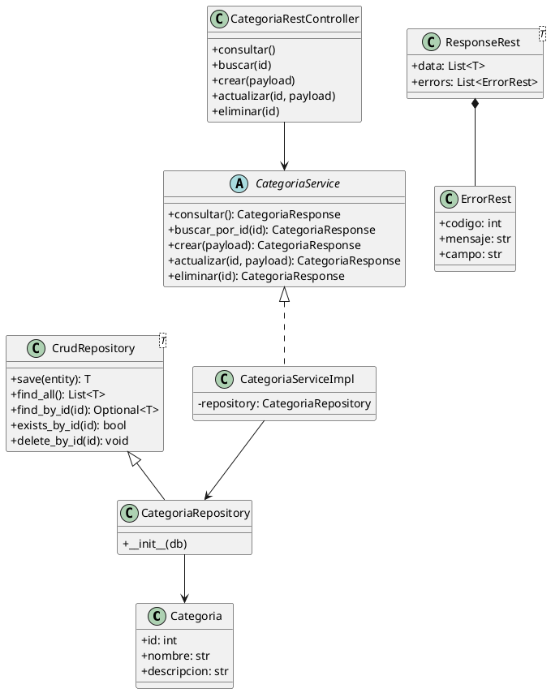

# Diseño — API de Categorías

> Tarea 02.02 — Universidad Politécnica Salesiana

## Arquitectura en capas

```
Cliente HTTP
    │
    ▼
Controlador (APIRouter)        app/controllers/categoria.py
    │   Depends(get_categoria_service)
    ▼
Servicio (ABC + Impl)          app/services/categoria.py
    │
    ▼
Repositorio (CrudRepository)   app/repositories/{base,categoria}.py
    │
    ▼
Modelo (SQLAlchemy)            app/models/categoria.py
    │
    ▼
Base de datos (MySQL / SQLite)
```

## Diagrama de clases (PlantUML)



## Mapeo UML (Spring Boot) → FastAPI

| Componente UML (Spring) | Equivalente FastAPI | Archivo |
|---|---|---|
| `@Entity @Table model.Categoria` | Modelo SQLAlchemy `Categoria` | `app/models/categoria.py` |
| `CrudRepository` | Clase genérica `CrudRepository[T]` | `app/repositories/base.py` |
| `CategoriaRepository` | `CategoriaRepository(CrudRepository[Categoria])` | `app/repositories/categoria.py` |
| `CategoriaService` (interface) | Clase abstracta `CategoriaService(ABC)` | `app/services/categoria.py` |
| `CategoriaServiceImpl` (`@Service`) | `CategoriaServiceImpl(CategoriaService)` | `app/services/categoria.py` |
| `CategoriaRestController` (`@RestController`) | `APIRouter` | `app/controllers/categoria.py` |
| `ErrorRest` / `ResponseRest<T>` | Modelos Pydantic | `app/schemas/response.py` |
| `ResponseEntity` | `JSONResponse` + `status_code` | controlador |
| `@Autowired` | `Depends(...)` | `app/dependencies.py` |
